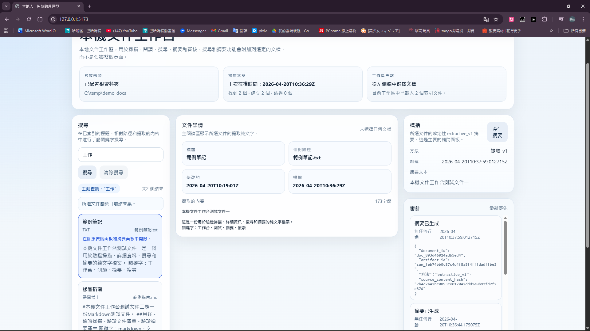

# Local AI Workbench

`local-ai-workbench` is the working repository for **Local AI Workbench**: a localhost, single-user document-to-knowledge workbench for scanning, searching, reviewing, summarizing, auditing, and exporting local document knowledge artifacts.

The public showcase identity is a local-first document-to-knowledge workbench, not a SaaS product and not a background automation platform. The project is intentionally small, inspectable, and local-first so a reviewer can understand exactly where data is read, where artifacts are produced, where Markdown exports are written, and where human approval boundaries sit.

## What Problem This Solves

Local document workflows often become a blurry mix of source files, generated summaries, agent suggestions, and accidental side effects. This repo explores a safer pattern:

- keep source documents local
- scan and review them through a localhost workbench
- produce deterministic review artifacts
- export Obsidian-ready Markdown notes after preview and approval
- represent AI-assisted work as explicit task/result/readback surfaces
- keep write-like actions behind preview, approval, and readiness gates
- avoid uncontrolled writeback

The app itself does not call an external AI service in the current baseline. The bridge utilities in `src/local_runner_bridge/` model a local-first AI workflow control layer around explicit inputs, validation dry-runs, stdout/readback artifacts, approval records, readiness gates, and implementation-boundary checks.

## Current Project Status

Current baseline:

- `M1` through `M9` complete
- `v1` complete
- showcase UI workbench redesign complete
- writeback safety/boundary chain complete enough as of #197
- normal project work resumes at #198
- product direction aligned as a Local Document-to-Knowledge Workbench at #204
- Obsidian-ready Markdown Export MVP completed through #211
- current roadmap recorded at #212

The #197 decision is important: **stop adding boundary layers**. Future work should return to visible project value such as README polish, demo documentation, architecture maps, onboarding notes, or test cleanup.

## Core Value

The current project value is a local-first workflow with explicit review boundaries:

- **Local document-to-knowledge workbench:** manually scan one configured root folder into SQLite and review documents on localhost.
- **Deterministic artifacts:** generate local single-document summary artifacts without external AI calls.
- **Obsidian-ready Markdown export:** preview and write generated Markdown notes to a user-selected local folder, such as an Obsidian Vault inbox.
- **Explicit task surfaces:** represent work as explicit local or fetched task references instead of broad issue scans.
- **Validation dry-runs:** validate inputs and contracts before any later action is considered.
- **Result/readback artifacts:** emit JSON review summaries to stdout for ChatGPT/human readback.
- **Approval/readiness gates:** model approval and readiness as local validation records, not implicit permission.
- **No uncontrolled writeback:** GitHub writeback, Result Packet write, runner/dispatcher/watcher behavior, and autonomous execution remain forbidden unless separately approved later.

This is different from a normal automation script because success at one step does not automatically trigger the next side effect. Each layer emits reviewable evidence and keeps authority bounded.

## What Is Implemented

### Local Document Workbench

- Configure one root folder through the web UI or API
- Manually scan `md`, `txt`, `pdf`, and `docx` files into SQLite
- List indexed documents and open document detail
- Search locally by title, relative path, and extracted content
- Generate deterministic single-document summary artifacts
- Review summary and audit context in the current workbench UI
- Preview Obsidian-ready Markdown for the selected document
- Export Markdown to a user-selected local destination folder after preview
- Remember the last export folder in the browser for smoother repeat use

### Local Runner Bridge Utilities

The `src/local_runner_bridge/` modules are local-only workflow control utilities. They include:

- Result Surface builder and sample stdout CLI
- Task Surface to Result Surface conversion for local text files
- explicit fetch to Result Surface adapter for local files and explicitly referenced GitHub issue/comment inputs
- Writeback Target Contract validator
- Writeback Dry-Run Preview builder
- Approval Record validator
- Readiness Gate validator
- Writeback Implementation Boundary validator

These utilities produce JSON evidence and validation summaries. They do not execute tasks, write GitHub comments, update issue bodies, write Result Packets, create PRs, merge, close issues, change labels, or start watchers.

## What Is Intentionally Not Implemented

The following remain intentionally out of scope:

- external LLM calls inside the app
- OCR or scanned-PDF recognition
- semantic search, embeddings, vector database, or FTS5
- multi-folder background sync
- watcher or scheduler behavior
- automatic email sending
- automatic modification of original source documents
- Obsidian plugin behavior
- Obsidian API integration
- two-way Obsidian sync
- vault-aware validation in the current baseline
- GitHub writeback implementation
- GitHub comment write
- GitHub issue body update
- Result Packet write implementation
- Codex-side action execution
- runner, dispatcher, or watcher behavior
- broad issue scan or next/latest issue inference
- autonomous execution
- automatic commit or push
- PR creation, merge, issue close, or label change
- real write mode

Future GitHub writeback is still not implemented and still requires a later explicit Strict Lane decision.

## Architecture Overview

- `api/`: FastAPI app, SQLite access, schemas, and route handlers
- `web/`: React + TypeScript workbench UI built with Vite
- `data/`: local runtime database area and local validation artifacts
- `src/local_runner_bridge/`: local-only bridge validators and stdout/readback CLIs
- `tests/`: API and bridge utility tests
- `docs/`: project documentation, decision notes, and demo/supporting docs
- `AGENTS.md`: repo-level collaboration and scope guardrails
- `PLANS.md`: project planning notes kept at repo root

The main application logic stays in the Python API. The web app stays focused on display and user interaction. The bridge utilities stay local-only and evidence-oriented.



*Local document workbench on localhost: left for search and indexed documents, center for the selected document detail, right for deterministic summary artifact and audit trail.*

## Local Setup

### API

```powershell
python -m venv .venv
.venv\Scripts\Activate.ps1
pip install -r api\requirements.txt
uvicorn api.app.main:app --reload
```

The API runs on `http://127.0.0.1:8000`.

### Web

```powershell
cd web
npm install
npm run dev
```

The Vite dev server runs on `http://127.0.0.1:5173`.

### Tests

```powershell
.venv\Scripts\Activate.ps1
python -m pytest tests\api -q -p no:cacheprovider
```

## Workbench Demo Walkthrough

1. Start the API with `uvicorn api.app.main:app --reload`.
2. Start the web app with `npm run dev` from `web/`.
3. Open `http://127.0.0.1:5173` in a browser.
4. In the workbench header, paste one existing local root folder path and save it.
5. Run `Scan documents` to index supported `md`, `txt`, `pdf`, and `docx` files into local SQLite.
6. Use keyword search in the left column to search indexed title, relative path, and extracted content.
7. Select a document to read extracted text in the center detail panel.
8. Generate or view the deterministic single-document summary in the right panel.
9. Use `Obsidian-ready Markdown Export` to preview the generated Markdown note.
10. Paste an existing local destination folder, such as an Obsidian Vault inbox.
11. Export the Markdown file after preview.
12. Inspect audit context in the right panel to see root folder, scan, summary, and export events.

This walkthrough stays local-first: one configured folder, manual scans, deterministic processing, SQLite, and localhost services only.


### Obsidian-ready Markdown Export

The export feature writes normal local Markdown files. It is designed to be Obsidian-ready, meaning the output can be placed in an Obsidian Vault or inbox folder and opened by Obsidian as a Markdown note.

Current boundary:

- supported: preview Markdown, export `.md` to a selected local folder, keep audit events
- supported: using an Obsidian Vault folder as the destination
- not implemented: Obsidian plugin
- not implemented: Obsidian API integration
- not implemented: vault-aware validation
- not implemented: two-way sync or background watcher


## Safe Local CLI Demos

These demos are safe local/readback demos for reviewer verification. They do not require a GitHub token, do not call GitHub, do not write GitHub comments, do not write Result Packets, and do not invoke runner, dispatcher, or watcher behavior.

#199 fixed the local CLI demo stability for Python 3.10-compatible usage. #200 only refreshes reviewer-facing demo commands; it does not add a new boundary layer. The project remains in normal project work mode after #197.

### Demo 1: Emit A Sample Result Surface

```powershell
$env:PYTHONPATH='src'; python -m local_runner_bridge.result_surface_cli --sample
```

Expected shape: one local-only sample Result Surface JSON object printed to stdout. This is readback evidence only and does not write files or external systems.

### Demo 2: Show The Writeback Target Contract Validator Help

```powershell
$env:PYTHONPATH='src'; python -m local_runner_bridge.writeback_target_contract_cli --help
```

Expected shape: CLI help showing the local-only `--contract-file` argument. Running the validator requires a local JSON file and prints validation summary JSON to stdout.

### Demo 3: Show The Writeback Boundary Validator Help

```powershell
$env:PYTHONPATH='src'; python -m local_runner_bridge.writeback_implementation_boundary_cli --help
```

Expected shape: CLI help showing the local-only `--boundary-file` argument. Running the validator requires a local JSON file and prints validation summary JSON to stdout.

### Demo 4: Validate Local JSON Artifacts

For a fuller local demo, create a temporary JSON file outside the repo and pass it to one of the local validators:

```powershell
$env:PYTHONPATH='src'; python -m local_runner_bridge.writeback_implementation_boundary_cli --boundary-file <path-to-local-boundary-json>
```

Expected shape: one validation summary JSON object printed to stdout. The validator reads one local file only and does not execute tasks.

## How To Read The Safety Chain

A reviewer should read the safety chain as a sequence of local evidence checkpoints:

```text
explicit Task Surface
-> authenticated read-only fetch
-> validation dry-run
-> Result Surface stdout/readback
-> Writeback Target Contract validation
-> local Dry-Run Preview
-> Approval Record validation
-> Readiness Gate validation
-> Implementation Boundary validation
```

The chain proves that reviewable local evidence can be built and validated. It does not prove or authorize uncontrolled external writes.

Key evidence:

- #166 proved authenticated live fetch to Result Surface stdout/readback.
- #172 implemented Writeback Target Contract validation.
- #177 implemented local Dry-Run Preview builder.
- #183 implemented Approval Record validation.
- #189 implemented Readiness Gate validation.
- #195 implemented Writeback Implementation Boundary validation.
- #196 proved the committed boundary validator with local smoke evidence.
- #197 recorded that the boundary chain is complete enough and should stop expanding.

## Why This Is Not Just Automation

Normal automation scripts often connect input success directly to side effects. This repo deliberately separates those concerns:

- input references must be explicit
- validation summaries are local/readback evidence
- previews are dry-run only
- approval records are validated artifacts, not hidden permission
- readiness gates preserve `dry_run_only` and no-real-write flags
- implementation-boundary validation keeps future writeback as a separate Strict Lane decision

That makes the project useful as a public portfolio example of controlled AI-assisted workflow design, not just a script that does things after parsing input.

## Notes For Reviewers

- The app is local and deterministic in the current baseline.
- Obsidian-ready export means local Markdown output, not an Obsidian plugin or sync engine.
- The bridge utilities are local-only evidence tools unless explicitly run with an authenticated read-only fetch path.
- The project intentionally avoids background schedulers and long-running automation.
- Write-like actions remain preview-before-approve work.
- The current #198 direction is normal project work, not more boundary layering.

See [Project Demo Flow Overview (#198)](docs/PROJECT_DEMO_FLOW_OVERVIEW_198.md) for a concise reviewer-facing path through the app and bridge demos.

## Next Practical Work

Good next steps should prioritize visible project value:

- keep README and demo flow aligned with shipped product behavior
- add vault-aware export validation only after the current Markdown export boundary is documented
- add a short architecture map
- document one polished demo script for the local workbench
- clean up old placeholder wording in docs
- improve CLI usage examples for local-only bridge utilities
- tidy API test coverage around preview, approve, and audit events
- write a developer onboarding guide

Avoid adding more writeback boundary layers by default.

## Non-Goals And Known Limits

- No OCR
- No scanned-PDF recognition
- No multi-folder support
- No watcher or background sync
- No external LLM
- No semantic search, embeddings, vector database, or FTS5
- No search filters, search history, or match highlighting
- No parser platform or orchestration layer
- No new file types beyond the current set
- No rich markdown rendering
- No multi-document summary
- No productization, auth, multi-user support, or SaaS framing
- No chat-first main UI

## AI Collaboration

This repo is designed to be worked on with human review and AI-assisted development, but the application itself does not call any external AI service.

When collaborating through an agent workflow:

- follow the repo-root guardrails in `AGENTS.md`
- keep scope aligned with the active baseline instead of inventing new milestones
- treat write-like actions as preview-before-approve work
- do not treat validation success as approval for external side effects

## Notes

- `data/app.db` is created automatically when the API starts.
- Public-release prep should keep local private assets, walkthrough outputs, validation databases, and temporary smoke inputs out of version control.
